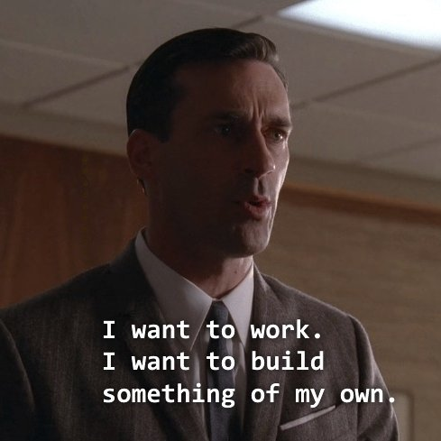

There are 1000 blogs out there. Why should you read this?

### Tired answer: 

We (you and me) have to figure that out

### Wired answer:

First thing - Thanks for taking your time to read this.

I have been trying to figure out what truly interests me. On a random Monday it is Data Science. Before the day ends it is Cinema. And after I wake up it is Sports Analytics. But one thing has remained constant - my love for Strawberries.

{width=100% .external}    

But on a serious note, I am starting this blog to articulate my thoughts and figuring out what works for me. I am trying to be more productive and hope this will keep me more accountable and honest. For you, I want this blog to be like a conversation with your friends about random things -  the ones that run late into the night and forget when you wake up the next day - except this will be here for you to revisit and enjoy from time to time. 

See you soon!


Rithic 


```{r setup, include=FALSE}
knitr::opts_chunk$set(echo = FALSE)

# Learn more about creating blogs with Distill at:
# https://rstudio.github.io/distill/blog.html

```


